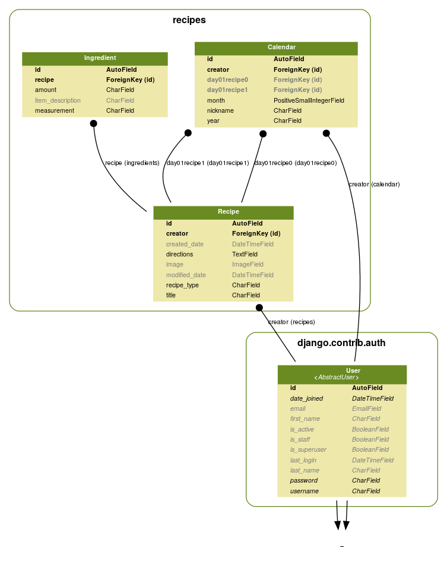

Database Models
===============

.. toctree::
   :maxdepth: 2
   :caption: Contents:

   models_recipes
   models_ingredients
   models_planning

Here is an overview of the model relationships.
This view is simplified because in reality there are many more day??recipe? foreign keys, but they are all the same.
Repeating them all here overly complicated that portion of the graph.
The relationships shown here reveal how rather simple the relationships are:

 - Regarding the inter-application relationships, both the calendar and recipe objects have a creator key to User
 - Calendar models have foreign keys to Recipe for each day
 - Ingredient has a foreign key to a recipe for defining that the ingredient is on that recipe

